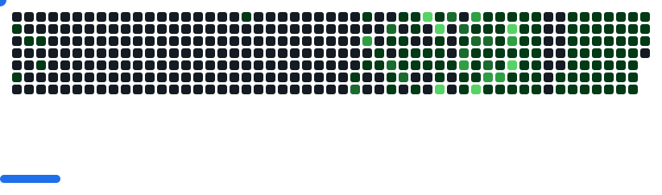

<h1 align="center">
  
</h1>

<h5 align="center">
  
  
  
  
    
  
</h5>

 

  𝙷𝚒, 𝙸'𝚖 Reyad Hassan, 𝚂𝚘𝚏𝚝𝚠𝚊𝚛𝚎 𝚀𝚞𝚊𝚕𝚒𝚝𝚢 𝙰𝚜𝚜𝚞𝚛𝚊𝚗𝚌𝚎 𝙴𝚗𝚐𝚒𝚗𝚎𝚎𝚛 𝚏𝚛𝚘𝚖 𝙱𝚊𝚗𝚐𝚕𝚊𝚍𝚎𝚜𝚑
   
  - 🔬 𝙸'𝚖 𝚌𝚞𝚛𝚛𝚎𝚗𝚝𝚕𝚢 𝚠𝚘𝚛𝚔𝚒𝚗𝚐 𝚊𝚝 Pathao Limited
     
  - 🎓 𝙸 𝚐𝚛𝚊𝚍𝚞𝚊𝚝𝚎𝚍 𝚏𝚛𝚘𝚖 Faridpur Engineering College - 𝙲𝚘𝚖𝚙𝚞𝚝𝚎𝚛 𝚂𝚌𝚒𝚎𝚗𝚌𝚎 & 𝙴𝚗𝚐𝚒𝚗𝚎𝚎𝚛𝚒𝚗𝚐 𝙳𝚎𝚙𝚊𝚛𝚝𝚖𝚎𝚗𝚝
     
  - 💻 𝙸 𝚕𝚘𝚟𝚎 𝚝𝚎𝚜𝚝𝚒𝚗𝚐 Api, 𝚆𝚎𝚋 𝚊𝚗𝚍 𝙼𝚘𝚋𝚒𝚕𝚎 𝙰𝚙𝚙𝚜
     
  - 🌱 𝙸'𝚖 𝚌𝚞𝚛𝚛𝚎𝚗𝚝𝚕𝚢 𝚕𝚎𝚊𝚛𝚗𝚒𝚗𝚐 𝚔𝟼, 𝙿𝚕𝚊𝚢𝚠𝚛𝚒𝚐𝚑𝚝, Locust
     
  - 📫 𝙷𝚘𝚠 𝚝𝚘 𝚛𝚎𝚊𝚌𝚑 𝚖𝚎: <a href="mailto:hassan.reyad01@gmail.com">hassan.reyad01@𝚐𝚖𝚊𝚒𝚕.𝚌𝚘𝚖</a>

##  My Github Stats

 

  
  
  

### My GitHub Trophies
 

    

### Languages and Tools
 

    
    
    
    
    
     
    
    
    
    
     
    
    
    
    
    
    
    
    
    
     
    
    

## Why So Serious!

<picture>
  <source
    media="(prefers-color-scheme: dark)"
    srcset="breakout-dark.svg"
  />
  
</picture>

